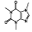

<h1 align="center" title="I'm happy to see you here">Welcome to @shanuv000</h1>

## Contact

## Summary

I'm a skilled AI and full-stack engineer with a focus on building intelligent applications. I help bring innovative solutions to life using machine learning, web development, and cloud technologies.

## Skills

- **Languages:** C++, Python, Java, C#, Javascript, PHP, TypeScript
- **AI & ML:** TensorFlow, Keras, PyTorch, OpenCV, OpenAI, YOLO
- **Web Development:** React, Vue, Angular, Next.js, Express, Nestjs, Django
- **Databases:** MySQL, PostgreSQL, MongoDB
- **Cloud & DevOps:** Azure, AWS, Docker, Kubernetes, Git

# Languages and Tools

  
<table style="text-align: center;">  
  <tr>  
    <td align="center" width="80" align="center" width="80">  
        
       C++  
    </td>  
      <td align='center' width="80">
            
           React
      </td>
    <td align="center" width="80">  
        
       Java  
    </td>  
    <td align="center" width="80">  
        
       C#  
    </td> 
    <td align="center" width="80">  
        
       Python  
    </td> 
    <td align="center" width="80">  
        
       PHP  
    </td>  
    <td align="center" width="80">  
        
       Javascript  
    </td>
    <td align="center" width="80">  
        
       NodeJs  
    </td>   
    <td align="center" width="80">  
        
       TS  
    </td>  
    <td align="center" width="80">  
      
       HTML  
    </td>  
    <td align="center" width="80">  
        
       CSS  
    </td> 
  </tr>  
  <tr>  
    <td align="center" width="80">  
          
       TF  
    </td>  
    <td align="center" width="80">  
        
       Cuda
    </td>  
    <td align="center" width="80">  
        
       Keras  
    </td>  
    <td align="center" width="80">  
        
       PyTorch  
    </td>  
    <td align="center" width="80">  
        
       Caffe  
    </td>
    <td align="center" width="80">  
        
       YOLO  
    </td>
        <td align="center" width="80">  
        
       OpenCV  
    </td>    
    <td align="center" width="80">  
        
       OpenAI  
    </td>  
    <td align="center" width="80">  
        
       ALPR  
    </td>  
    <td align="center" width="80">  
        
       Face 
    </td>  
  </tr>  
  <tr>  
    <td align="center" width="80">  
        
       Express  
    </td>
    <td align="center" width="80">  
        
       Nestjs  
    </td>
    <td align="center" width="80">  
        
       Django  
    </td>
    <td align="center" width="80">  
        
       Flask  
    </td>
    <td align="center" width="80">  
        
       .Net  
    </td>
    <td align="center" width="80">  
        
       Spring  
    </td>
    <td align="center" width="80">  
        
       Hibernate  
    </td>
    <td align="center" width="80">  
        
       WordPress  
    </td>
    <td align="center" width="80">  
        
       CI  
    </td>
    <td align="center" width="80">  
        
       Laravel  
    </td>
  </tr>
  <tr>  
    <td align="center" width="80">  
        
       React  
    </td>
    <td align="center" width="80">  
        
       Vue  
    </td>
    <td align="center" width="80">  
        
       Next  
    </td>
    <td align="center" width="80">  
        
       Angular  
    </td>
    <td align="center" width="80">  
        
       Svelte  
    </td>
    <td align="center" width="80">  
        
       Electron  
    </td>
    <td align="center" width="80">  
        
       Alpinejs  
    </td>
    <td align="center" width="80">  
        
       Tailwind  
    </td>
    <td align="center" width="80">  
        
       Threejs  
    </td>
    <td align="center" width="80">  
        
       BS  
    </td>
  </tr>
  <tr>  
    <td align="center" width="80">  
        
       MySql  
    </td>
    <td align="center" width="80">  
        
       PgSQL  
    </td>
    <td align="center" width="80">  
        
       Mongo
    </td>
    <td align="center" width="80">  
        
       Git  
    </td>
    <td align="center" width="80">  
        
       GitHub  
    </td>
    <td align="center" width="80">  
        
       Docker  
    </td>
    <td align="center" width="80">  
        
       Azure  
    </td>
    <td align="center" width="80">  
        
       Nginx  
    </td>
    <td align="center" width="80">  
        
       AWS  
    </td>
    <td align="center" width="80">  
        
       RP 
    </td>
  </tr>
</table>  

     
  
## 📊 GitHub Stats:  
    
   
 
